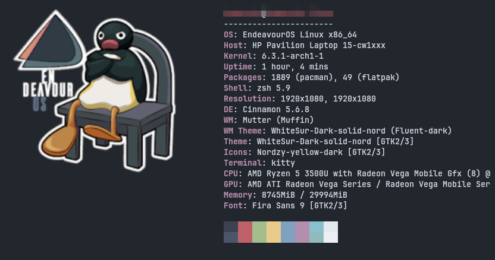
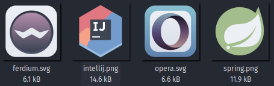

More NORD dotfiles goodies from Tom coming with time.

Info about my riced system:

Setup:

- Theme: [WhiteSur Dark Solid Nord](https://www.gnome-look.org/p/1704248)

- Icons: [Nordzy Yellow Dark](https://github.com/alvatip/Nordzy-icon)

- Terminal: [Kitty](https://github.com/kovidgoyal/kitty) with [tdrop](https://github.com/noctuid/tdrop) to create a Quake-like dropdown effect + [Kitty nord theme](https://github.com/connorholyday/nord-kitty) + zsh shell with [OhMyZsh]([https://github.com/ohmyzsh/ohmyzsh) and [P10k](https://github.com/romkatv/powerlevel10k)

- Wallpaper:
  
  

- a couple custom icons [ferdium, intellij_idea, opera_browser, spring_boot_project]
  
  

- ulauncher config

- neofetch config with my lovable nordic pingu 🐧🐧🐧
